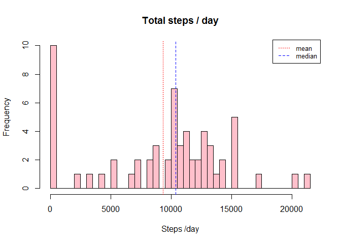
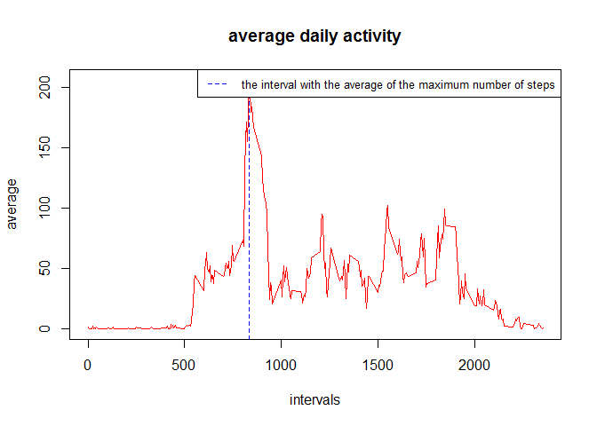
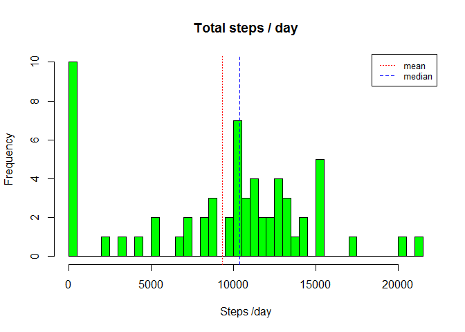
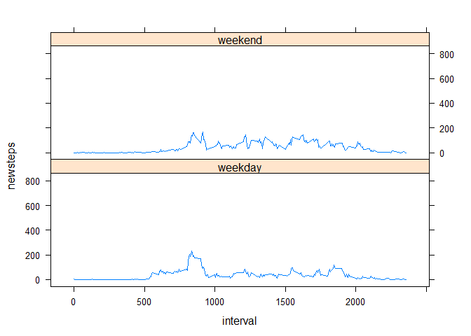

1- Getting the data
-------------------

Read the data.

    data     <- read.csv("activity.csv", stringsAsFactors=FALSE)

2- What is mean total number of steps taken per day?
----------------------------------------------------

Ignore the missing values in the dataset, and Calculate the total number
of steps taken per day.  
We also calculate and report the mean and median of the total number of
steps taken per day.

    library(plyr)
    data1 <- ddply(data,.(date),summarize,totalsteps=sum(steps, na.rm = TRUE))
    hist(data1$totalsteps,col="pink",breaks=40,main="Total steps / day",xlab="Steps /day")
    abline(v=mean(data1$totalsteps),lty=3, col="red")
    abline(v=median(data1$totalsteps),lty=2, col="blue")
    legend("topright", legend=c("mean", "median"),  col=c("red", "blue"), lty=c(3,2), cex=0.8)

The Mean and median number of steps taken each day :

    mean(data1$totalsteps)

    ## [1] 9354.23

    median(data1$totalsteps)

    ## [1] 10395

3- What is the average daily activity pattern?
----------------------------------------------

Make a time series plot of the 5-minute interval (x-axis) and the
average number of steps taken, averaged across all days (y-axis)

    data2 <-ddply(data,.(interval),summarize,meansteps=mean(steps, na.rm = TRUE))
    plot(data2$interval, data2$meansteps,type="l",col="red",main="average daily activity", xlab="intervals", ylab="average")
    abline(v=data2$interval[which.max(data2$meansteps)], lty=2, col="blue")
    legend("topright", legend=" the interval with the average of the maximum number of steps",  col="blue", lty=2, cex=0.8)

4- Imputing missing values
--------------------------

Calculate and report the total number of missing values in the dataset

    number_na <- sum(is.na(data$steps))
    number_na

    ## [1] 2304

Create a new dataset that is equal to the original dataset but with the
missing data filled in by using the average number of steps in
particular 5-minutes interval

    data3 <- data
    for (i in 1:nrow(data3))
    {  if (is.na(data3[i,"steps"]))
           data3[i,"newsteps"] <- subset(data2$meansteps, (data2$interval == data3[i,"interval"]))
       else
           data3[i,"newsteps"] <- data3[i,"steps"]
    }

look what new data like

    head(data3)

    ##   steps       date interval  newsteps
    ## 1    NA 2012-10-01        0 1.7169811
    ## 2    NA 2012-10-01        5 0.3396226
    ## 3    NA 2012-10-01       10 0.1320755
    ## 4    NA 2012-10-01       15 0.1509434
    ## 5    NA 2012-10-01       20 0.0754717
    ## 6    NA 2012-10-01       25 2.0943396

Make a histogram of the total number of steps taken each day and
Calculate and report the mean and median total number of steps taken per
day

    data4 <- ddply(data3,.(date),summarize,totalsteps=sum(steps, na.rm = TRUE))
    hist(data4$totalsteps,col="green",breaks=40,main="Total steps / day",xlab="Steps /day")
    abline(v=mean(data4$totalsteps),lty=3, col="red")
    abline(v=median(data4$totalsteps),lty=2, col="blue")
    legend("topright", legend=c("mean", "median"),  col=c("red", "blue"), lty=c(3,2), cex=0.8)  

The Mean and median values:

    mean(data4$totalsteps)

    ## [1] 9354.23

    data4$totalsteps

    ##  [1]     0   126 11352 12116 13294 15420 11015     0 12811  9900 10304
    ## [12] 17382 12426 15098 10139 15084 13452 10056 11829 10395  8821 13460
    ## [23]  8918  8355  2492  6778 10119 11458  5018  9819 15414     0 10600
    ## [34] 10571     0 10439  8334 12883  3219     0     0 12608 10765  7336
    ## [45]     0    41  5441 14339 15110  8841  4472 12787 20427 21194 14478
    ## [56] 11834 11162 13646 10183  7047     0

5-Are there differences in activity patterns between weekdays and weekends?
---------------------------------------------------------------------------

Create a new factor variable in the dataset with two levels - "weekday"
and "weekend" indicating whether a given date is a weekday or weekend
day.

    library(lubridate)

    ## 
    ## Attaching package: 'lubridate'

    ## The following object is masked from 'package:plyr':
    ## 
    ##     here

    ## The following object is masked from 'package:base':
    ## 
    ##     date

    for (i in 1:nrow(data3))
    {  if (wday(as.Date(data3[i,"date"]) ) %in%c(1,7) )
           data3[i,"newday"] <- "weekend"
       else
           data3[i,"newday"] <- "weekday"
    }
    data3$newday <- as.factor(data3$newday)

Summary of the new variable

    table(data3$newday)

    ## 
    ## weekday weekend 
    ##   12960    4608

Make a panel plot containing a time series plot of the 5-minute interval
(x-axis) and the average number of steps taken, averaged across all
weekday days or weekend days (y-axis)

    library(lattice)
    xyplot(newsteps~interval|newday,data=data3,type='a',layout=c(1,2))

